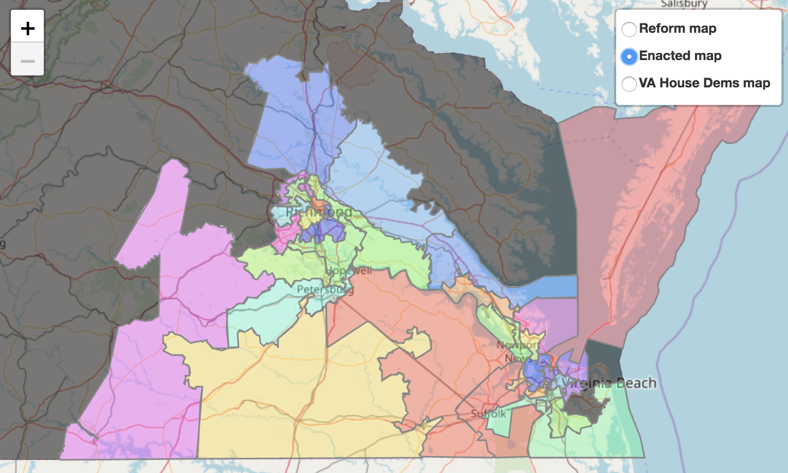

This folder contains the shapefile for the full enacted House of Delegates map. Below is the enacted map, limited to the 33 districts affected by the Bethune-Hill case.

Click to explore the map interactively.

