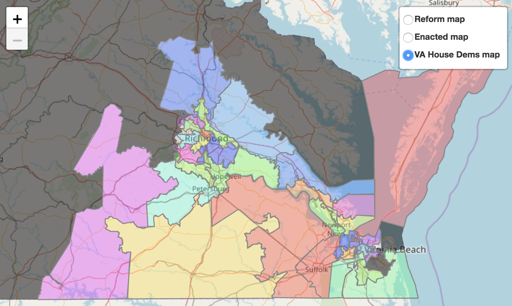

This folder contains the shapefile for the map proposed by the [VA House Democrats](http://redistricting.dls.virginia.gov/2010/RedistrictingPlans.aspx#42) on 8/29/2018. The map, limited to the 33 districts affected by the Bethune-Hill case, is pictured below

Click to explore the map interactively.

