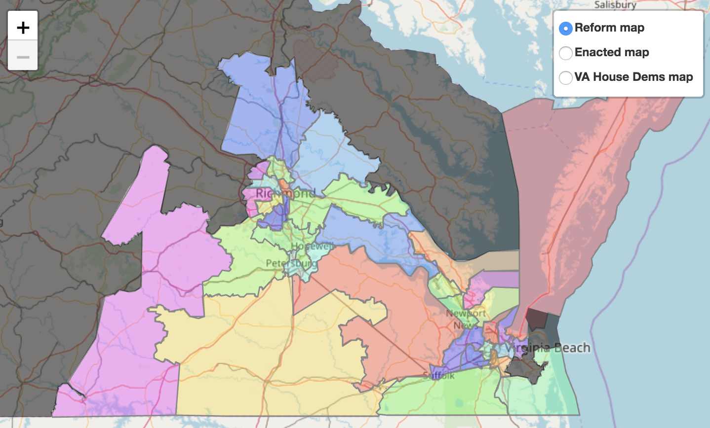

This folder contains the shapefile for the reform map, which includes a redrawing of the 11 unconstitutional districts and the 22 districts adjacent to those, by the [Princeton Gerrymandering Project](http://gerrymander.princeton.edu), as well as a [report on various statistics](Reform%20map%20report.csv) of the map, including BVAP and VAP. The map is pictured below.

Click to explore the map interactively.

We also include the shapefile for the 33 redrawn districts along with the 67 other districts as enacted. We also include a block equivalency file for this map in which each row consists of a census block GEOID along with the ID of the district that contains it.