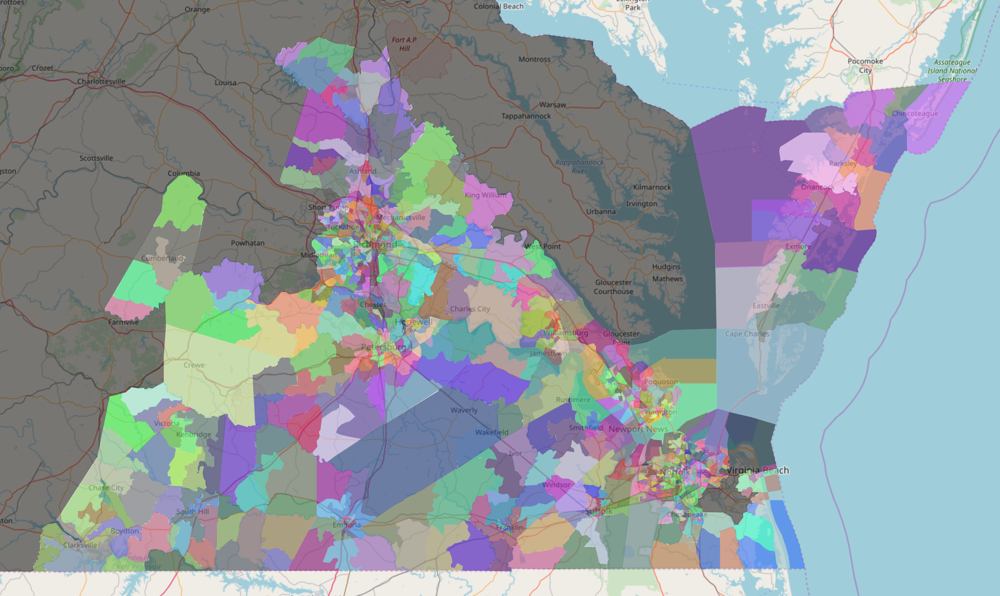

This folder contains the shapefile for the voting precincts in the 33 districts relevant to the Bethune-Hill case. As identified by the [Virginia Public Access Project](https://www.vpap.org/visuals/visual/ruling-could-impact-1-3-house-districts), these districts are:
  - 11 affected districts identified by the federal district court as racial gerrymanders: [63, 69, 70, 71, 74, 77, 80, 89, 90, 92, 95]
  - 22 districts directly adjacent to the above: [27, 55, 61, 62, 64, 66, 68, 72, 73, 75, 76, 78, 79, 81, 83, 85, 91, 93, 94, 96, 97, 100]
  
This shapefile was generated by the following procedure:

1) Demographic data for each census block
    - A census block shapefile for VA was obtained from the Census ([221 MB Zip file](https://www2.census.gov/geo/tiger/TIGER2010BLKPOPHU/tabblock2010_51_pophu.zip)).
    - Race for the Population 18 and Over ([Census source code P10](https://factfinder.census.gov/faces/tableservices/jsf/pages/productview.xhtml?src=bkmk); [119 MB CSV file](https://drive.google.com/a/princeton.edu/file/d/12PcBW7nVuzD_r05t_Vrc6MLwgF_WaYTX/view?usp=sharing), [codebook](https://drive.google.com/a/princeton.edu/file/d/12JaVWt8CEB2vuJLK4cqrUwt5Ne8CiiFo/view?usp=sharing))  for each block in VA was obtained from IPUMS NHGIS. This includes data for what is commonly referred to as BVAP (Black Voting Age Population) and VAP (Voting Age Population).
    - We merged the demographic data with the census blocks.

2) Precinct collection
    - Previously, we (primarily [Connor Moffatt](https://github.com/connormoffatt) and [Jacob Wachspress](https://github.com/jacobwachspress)) had contacted each county-equivalent in Virginia, asking for their election precinct geographies. In some cases, they provided shapefiles, and in some cases they provided PDFs that we traced using tools in [this repository](https://github.com/PrincetonUniversity/gerrymander-geoprocessing). We have all of the precincts except for those of Sussex County, which we treated as a single precinct. We merged these shapefiles with election results from the VA Department of Elections. ([6 MB zip file](https://drive.google.com/a/princeton.edu/file/d/1An_ysqVWmvLRiLAvTaAqwxb_qeSt_Joi/view?usp=sharing)) _We should soon have this file for the whole state of Virginia._
    - We used [this tool](https://github.com/PrincetonUniversity/gerrymander-geoprocessing/blob/master/areal_interpolation/areal_interpolation.py) to aggregate BVAP and VAP into each precinct, distributing the population in a winner-take-all fashion such that precincts have the total BVAP and VAP of each census block that falls mostly into that precinct. This can also be done in a proportional fashion, a process sometimes called [proration](https://github.com/gerrymandr/Preprocessing/).
    
3) Shapes for VA House of delegates
    - We downloaded the shapefile for the enacted VA House of Delegates map from the Census ([0.5 MB Zip file](https://www2.census.gov/geo/tiger/GENZ2017/shp/cb_2017_51_sldl_500k.zip)).
    - We include only precincts for which a majority of the area falls into one of the 33 districts listed above.
    
To replicate this process, download the above 4 files, clone or download our [gerrymander-geoprocessing repository](https://github.com/PrincetonUniversity/gerrymander-geoprocessing) and change the paths in [precinct_processing.py](precinct_processing.py) accordingly.
